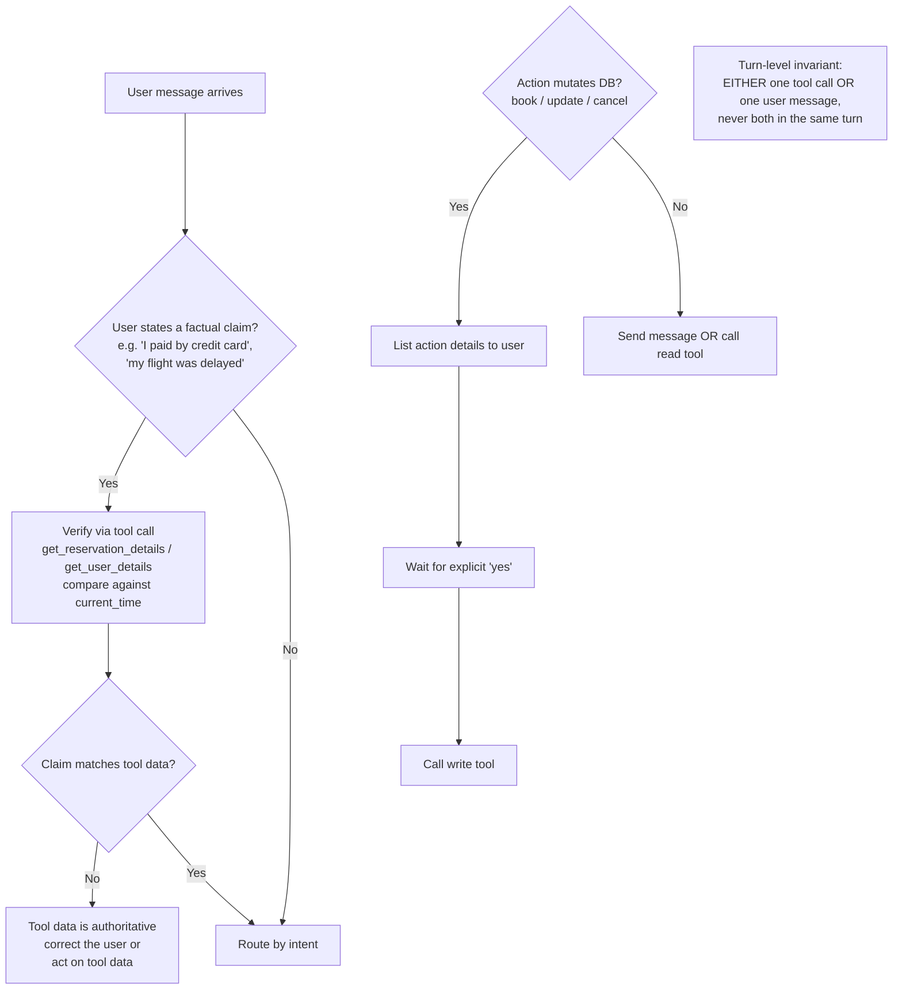
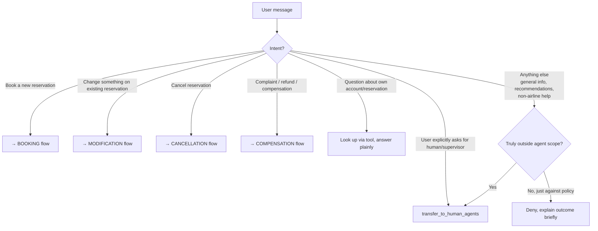
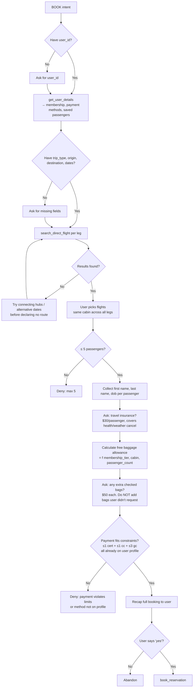
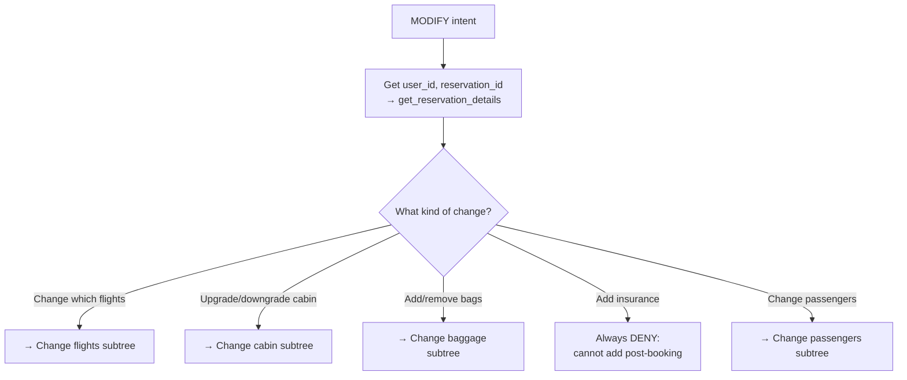
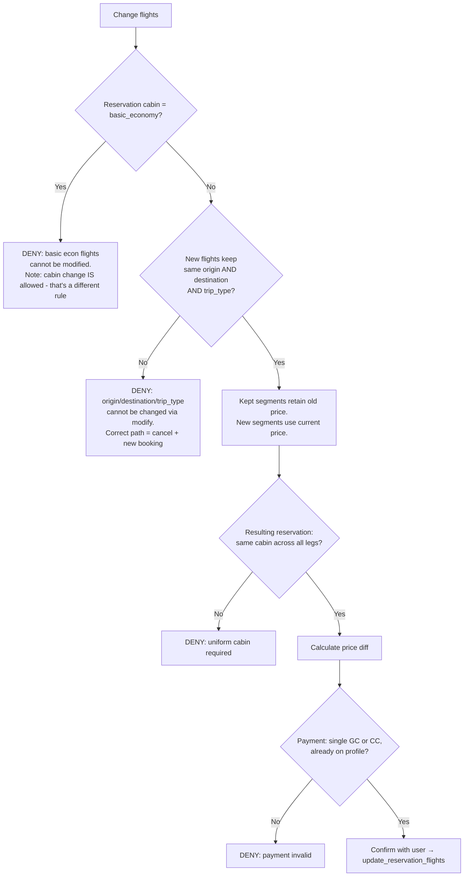
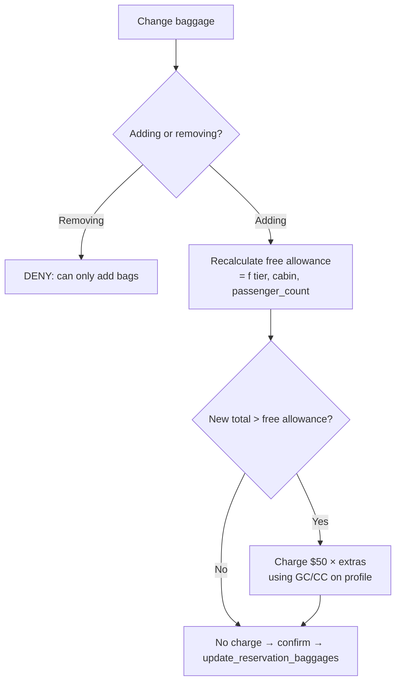
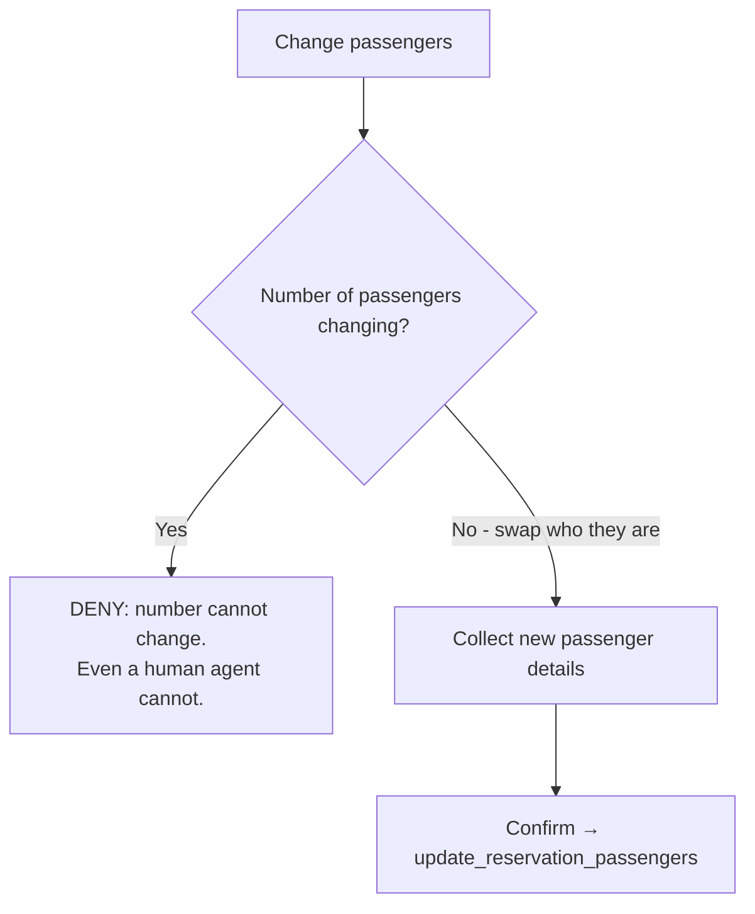
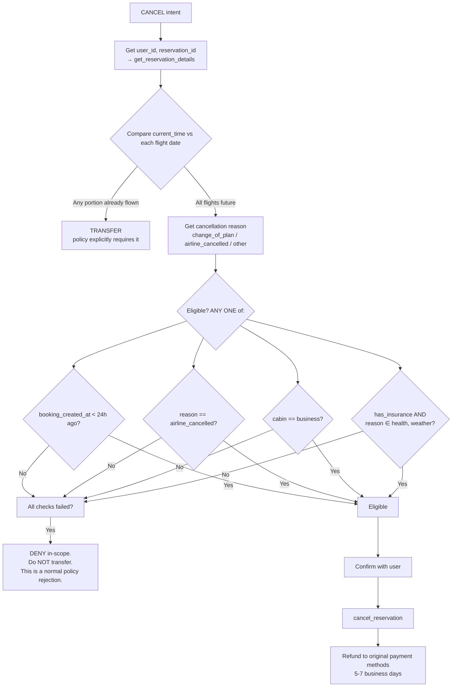
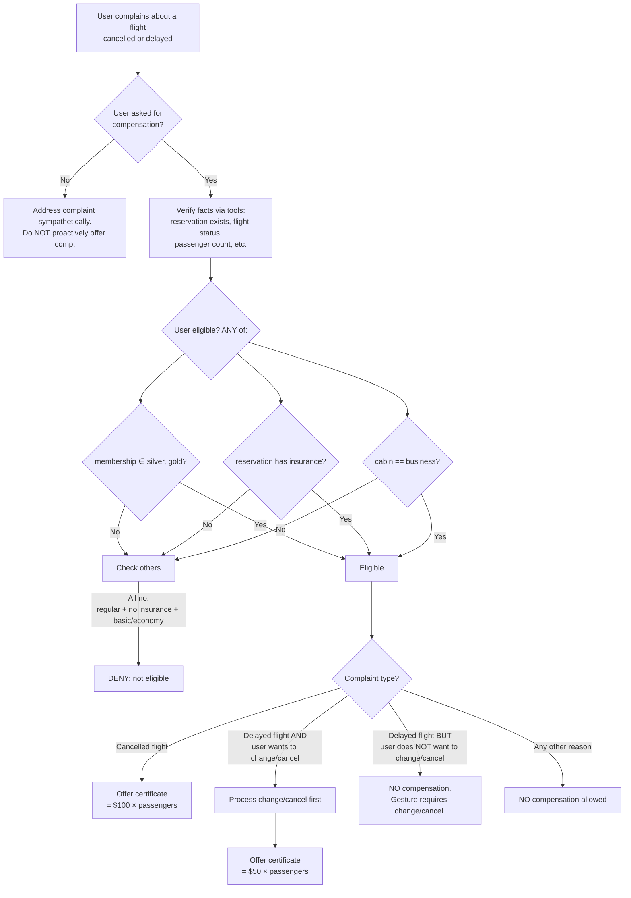

# Airline agent — decision tree

Companion to `policy.md`. This document expresses the *logic* the agent has to execute, in tree form, so the structure is visible and we can later reason about which parts need prompts, tools, or validators.

Two cross-cutting layers apply to every turn:

1. **Universal protocol** (every turn): one action per turn, confirm before write, verify user claims with tools, treat tool data as authoritative on conflict.
2. **Transfer-vs-deny criterion**: deny is the default for in-scope policy rejections; transfer is reserved for already-flown-flight cancellations, user-requested escalations, and genuinely out-of-scope requests.

The rest of this doc lays out the decision logic in 5 trees: top-level router, then one per operation (book, modify, cancel, compensate).

---

## 0. Universal protocol — applies before/around every response



---

## 1. Top-level router — what is the user asking for?



---

## 2. BOOKING flow



---

## 3. MODIFICATION flow

Modification fans out into 5 sub-trees: change flights, change cabin, change baggage, change insurance, change passengers. Each has different eligibility rules.



### 3a. Change flight segments



### 3b. Change cabin

```mermaid
flowchart TD
    C1[Change cabin] --> C2{Any flight in reservation<br/>already flown?<br/>compare current_time vs flight date}
    C2 -->|Yes| CDENY1[DENY: cabin cannot change<br/>after any flight is flown]
    C2 -->|No| C3{Applies to ALL flights<br/>AND ALL passengers?}
    C3 -->|No| CDENY2[DENY: cabin must be uniform]
    C3 -->|Yes| C4[Calculate diff = new_price − original_price]
    C4 --> C5{Diff > 0?}
    C5 -->|Yes| C6[User pays diff]
    C5 -->|No| C7[Refund |diff| to user]
    C6 --> C8{Payment: single GC or CC,<br/>already on profile?}
    C7 --> C8
    C8 -->|No| CDENY3[DENY: payment invalid]
    C8 -->|Yes| C9[Confirm → update_reservation_flights<br/>with new cabin, same flights]
```

### 3c. Change baggage



### 3d. Change passengers



---

## 4. CANCELLATION flow



---

## 5. COMPENSATION flow



---

## 6. Transfer-vs-deny reference card

The single most-confused decision in the whole policy. Memorize:

| Situation | Action |
|---|---|
| User asks for human / supervisor / "transfer me" | TRANSFER |
| User wants to cancel and any portion of flight already flown | TRANSFER (policy explicitly requires it) |
| Request genuinely outside agent's tools (e.g., "change my legal name on file") | TRANSFER |
| Basic-economy flight modification requested | DENY (in-scope) |
| Adding insurance after booking | DENY (in-scope) |
| Removing a passenger | DENY (in-scope, even a human can't do it) |
| Cancel with reason=change-of-plan, booking > 24h ago, no insurance | DENY (in-scope) |
| Compensation request for regular member with basic econ and no insurance | DENY (in-scope) |
| User pushes back after a valid denial ("but I was told otherwise") | HOLD the denial. Do NOT transfer just because user pushed back. |

**Rule of thumb:** if the policy gives an answer (yes or no), the agent gives it. Transfer is only for "the policy doesn't cover this" or "the flight is already flown."

---

## 7. Where each tree maps to v0's tools

| Tree | Read tools | Write tools |
|---|---|---|
| Booking | `get_user_details`, `search_direct_flight`, `calculate` | `book_reservation` |
| Modify flights | `get_reservation_details`, `search_direct_flight`, `calculate` | `update_reservation_flights` |
| Modify cabin | `get_reservation_details`, `search_direct_flight` (for new cabin price), `calculate` | `update_reservation_flights` (with new cabin) |
| Modify baggage | `get_reservation_details`, `calculate` | `update_reservation_baggages` |
| Modify passengers | `get_reservation_details` | `update_reservation_passengers` |
| Cancel | `get_reservation_details` | `cancel_reservation` |
| Compensation (gesture) | `get_reservation_details`, `get_user_details`, `calculate` | (no compensation write tool — gesture is verbal; certificate creation is out of current tool scope, so "offer" is the action) |
| Transfer (any) | — | `transfer_to_human_agents` |

A gap worth noting: **there is no tool to actually issue a compensation certificate.** The policy describes offering one ($100 × passengers, $50 × passengers), but no `issue_certificate` tool exists. The agent can verbally "offer" the certificate but cannot grant it. This may be why compensation tasks frequently end in agent confusion.

---

## 8. Reading this doc downstream

When designing the prompt: each tree's decision points map to either prompt-statable rules or tool/validator logic. The policy currently puts all rules in prose; the tree makes clear which rules are simple (booleans → fits in prompt) vs which are reasoning chains (better as a validator tool).

When designing v2 (tools/process layer): the explicit decision points in trees 3a, 3b, 4, and 5 are good candidates for a `validate_action` tool — programmatic eligibility checks the agent can call rather than re-derive in prose.

When designing the workshop: tree 6 (transfer-vs-deny) is the single most-misapplied rule in v0 and v1. Worth a slide of its own.
