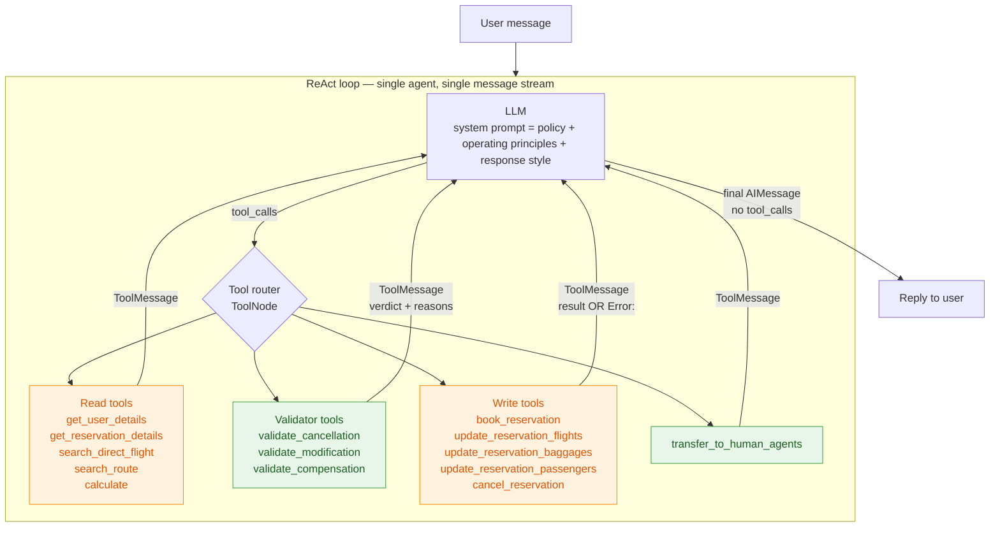

# v3 — Policy-aware agent architecture

Companion to `data/policy.md` and `data/decision-tree.md`. This document
proposes the structural shape of v3 — the version of the agent whose job
is to *reliably apply* the policy, not just hold it in a prompt.

v1 (`src/agents/v1/architecture.md`) and v2 (`src/agents/v2/architecture.md`)
both use a single LangGraph `create_react_agent` loop with the same 10 tools.
v1 ships the policy as flat markdown; v2 wraps it in XML and adds
`<operating_principles>` + `<response_style>`. Both versions move tone
and routing failures, but the decision tree exposes a class of failures
neither can fix in-prompt: *rule application*. Examples that recur in
the v1/v2 evals:

- Cancelling a flight without checking the 24h / business / insurance
  eligibility — the model "knows" the rule from the prompt but doesn't
  always derive whether the current reservation satisfies it.
- Offering compensation to a regular member in basic economy with no
  insurance (compensation flow, branch `ZDENY1`).
- Transferring on what should be a denial (the famous transfer-vs-deny
  confusion captured in decision-tree §6).

The question this doc answers: **what structural change in v3 makes
those rule-application failures hard to commit, rather than relying on
the model to re-derive the policy correctly every turn?**

---

## What v3 inherits unchanged

These are settled by v1/v2 and not up for debate here:

- LangGraph as the runtime; ChatOpenAI → OpenRouter → Kimi K2.6 as the model.
- Policy text lives in `data/policy.md`, loaded into the system prompt.
- Per-session `Store` (in-memory, mutable); 10 tau2-aligned tools as the
  baseline tool surface.
- Langfuse for observability, Chainlit for the UI.
- Universal protocol (one action per turn, confirm-before-write, tools
  authoritative over user claims) — already enforced by the prompt and
  the ReAct loop. v3 keeps this.

---

## Two cross-cutting layers (recap from `decision-tree.md`)

Whatever structure v3 adopts, these two layers apply to every turn:

1. **Universal protocol** — verify user claims via tools, single
   action per turn, confirm before any DB write, tool data is
   authoritative on conflict.
2. **Transfer-vs-deny criterion** — `transfer` is reserved for
   already-flown cancellations, user-requested escalations, and
   genuinely out-of-scope requests; `deny` is the default for in-scope
   policy rejections.

These are policies *on the agent*, not on the domain — and they sit
above the choice of architecture below.

---

## Options considered

Three architectural shapes are credible for v3. They differ in *where the
policy gets enforced* and *how many LLM calls happen per turn*.

### Option A — Single agent + validator tools (the "tools + process" path)

Keep v2's single `create_react_agent` loop. Add a small set of
*validator tools* that the agent must call before a write:

- `validate_cancellation(reservation_id, reason)` → `{eligible: bool, reasons: [...]}`
- `validate_modification(reservation_id, change_kind, payload)` → same shape
- `validate_compensation(reservation_id, complaint_kind)` → `{eligible, amount, reasons}`
- `search_route(origin, destination, date)` → wraps `search_direct_flight`
  with a hub fallback (fixes the "no direct → declared no route" failure)

The validators encode the decision-tree subtrees (3a, 3b, 4, 5) as code
rather than prose. The agent's job becomes: gather inputs → call the
right validator → on `eligible=true`, confirm and call the write tool;
on `eligible=false`, deny with the validator's reason.

Tighter tool schemas land here too: `cabin: Literal["basic_economy",
"economy", "business"]`, airport-code validators, etc.

```
   user msg ──▶ ReAct(LLM + 10 tau2 tools + 4 validators + 4 tightened reads)
              one identity, one message stream, one loop
```

**Strengths**

- Smallest delta from v2 — one new tool class, no new graph nodes, no
  new LLM calls per turn. Workshop attendees can attribute the lift
  cleanly ("we added validators, eval went from X to Y").
- Validators are *unit-testable* in pure Python — they take a
  reservation + a change request, return a verdict. No LLM involved in
  the eligibility computation, so no flakiness in the reasoning step.
- Compensation, the most error-prone flow in v1/v2, becomes a deterministic
  function of `(membership, cabin, insurance, complaint_kind,
  passenger_count)` — exactly the variables in decision-tree §5.
- Aligns with Anthropic's "start with the simplest thing that works"
  guidance — workflows over autonomous-multi-agent until the simpler
  shape proves insufficient.

**Weaknesses**

- The agent is still responsible for *choosing* which validator to
  call and parsing its result. A confused model can still skip the
  validator. v3 must enforce "validator-before-write" in the prompt and
  reinforce it via eval failures.
- Single system prompt has to hold the full policy. As the policy grows
  this becomes a context-attention problem (less likely at ~36 rules).

### Option B — Supervisor + specialist subagents (LangGraph multi-agent)

Add a router/triage agent on top of four specialists, one per flow:
`booking_agent`, `modification_agent`, `cancellation_agent`,
`compensation_agent`. Each specialist gets a narrower system prompt
(only the relevant policy section) and a narrower tool subset.
Read-only lookups stay with a shared `info_agent` or live on the
supervisor.

This is the LangGraph "primary assistant + specialized assistants"
pattern, and it's exactly the structure of LangGraph's own customer
support tutorial (and the Swiss Airlines reference port of it).

```
   user msg ──▶ supervisor (router LLM)
                    │
                    ├──▶ booking_agent       (subset of tools)
                    ├──▶ modification_agent  (subset of tools)
                    ├──▶ cancellation_agent  (subset of tools)
                    └──▶ compensation_agent  (subset of tools)
```

**Strengths**

- Mirrors the 5-tree shape of `decision-tree.md` 1:1. Each specialist
  owns its subtree; the supervisor owns the router (tree 1).
- Narrower prompts per specialist — the modification specialist doesn't
  need to know compensation rules, so the cabin-modification rule is
  literally next to the cabin-modification context.
- Easy to evolve: adding a new flow (e.g., "loyalty status query") is
  another specialist, no rewrite of the others.
- Maps nicely to the LangGraph supervisor pattern that the framework
  documents and tutorials are built around.

**Weaknesses**

- Doubles the LLM cost on every turn — supervisor routing call +
  specialist call. For a single-user workshop demo this is invisible;
  for batch eval (50 tasks × ~30 turns each) it adds up.
- The hardest failure mode in v1/v2 was *applying* the rule, not
  *picking which flow*. The router LLM doesn't solve the rule-application
  problem; it just defers it to the specialist. So Option B introduces
  structural complexity *without addressing the root failure*.
- More moving parts to teach in a 1-hour workshop. Each handoff has
  state, message-passing rules, and an eval failure surface of its own.
- Inter-agent state management is a real engineering tax — what does
  the booking specialist do if mid-booking the user pivots to
  cancelling a different reservation? Either the supervisor re-routes
  (losing partial state) or the specialist handles cross-flow
  (defeating the point of specialization).

### Option C — Single agent + LangGraph subgraphs per flow (hybrid)

Keep the single-identity ReAct surface from Option A, but compile each
flow as its own subgraph (with its own validators and tools). The
top-level graph has a router node + 5 subgraph nodes; routing is a
function call, not an LLM call.

```
   user msg ──▶ ReAct(LLM)
                  │
                  ├──▶ booking_subgraph
                  ├──▶ modification_subgraph
                  ├──▶ cancellation_subgraph
                  ├──▶ compensation_subgraph
                  └──▶ read_only_subgraph
```

**Strengths**

- Same per-subtree clarity as Option B, but the routing is structural
  (one LLM picks a tool that happens to be a subgraph) rather than a
  separate LLM call.
- Subgraph boundaries are good observability units — Langfuse will
  show traces grouped by flow.

**Weaknesses**

- LangGraph subgraphs don't actually buy much over a flat ReAct graph
  with scoped tools, *unless* each subgraph needs its own state schema.
  For this policy, the validators in Option A already encode the
  per-flow eligibility logic without needing dedicated state.
- More engineering work than Option A. The "subgraph" boundaries are
  largely cosmetic if the LLM is still making the routing decision and
  the tools are the same.

---

## Comparison at a glance

| Axis | A. Validators | B. Supervisor + Specialists | C. Subgraphs |
|---|---|---|---|
| LLM calls per turn | 1 | 2 (router + specialist) | 1 |
| Lines of code change from v2 | ~200 (new tools) | ~800 (router + 4 agents + handoff) | ~500 (graph rewrite) |
| Addresses rule-application failures | **Yes — directly** | Indirectly (narrower prompt helps but reasoning still in LLM) | Like A — validators still needed |
| Addresses routing failures | Less (single LLM still routes) | Yes (dedicated router) | Less |
| Workshop teachability | High — one new concept (validators) | Medium — handoffs, state, message-passing | Medium — subgraph mental model |
| Eval cost (50 tasks × ~30 turns) | 1x baseline | ~2x baseline | 1x baseline |
| Unit-testable in pure Python | Yes (validators) | No (each specialist still LLM-driven) | Partial |
| Risk of regressing what v2 fixed | Low | Medium (different prompt = different tone failures) | Low |

---

## Recommendation: **Option A**

Adopt the **single agent + validator tools** structure for v3.

The reasoning:

1. **The failure class to fix is rule-application, not routing.** The
   v1/v2 evals show the agent usually identifies *which flow* correctly
   (cancel vs modify vs compensate). It fails on *whether the current
   case satisfies the eligibility rule*. A supervisor solves routing;
   it doesn't solve eligibility. Validators do.

2. **Decision-tree §8 explicitly anticipates this.** The
   decision-tree document already calls out the §3a, §3b, §4, §5 subtrees
   as "good candidates for a `validate_action` tool — programmatic
   eligibility checks the agent can call rather than re-derive in prose."
   v3 is the operationalization of that paragraph.

3. **Workshop pedagogy.** v2 added pure prompting (structure + principles +
   tone). v3 adds *tools and process* — a different axis. v4 (if we get
   there) can add *graph structure* (specialists) and the audience will
   be able to measure each layer's contribution independently. Jumping
   straight to multi-agent collapses two lessons into one and makes the
   attribution muddy.

4. **Anthropic's "Building Effective Agents" prescription.** Start with
   the simplest shape that works. Workflows and well-scoped tools beat
   autonomous multi-agent for tasks with predictable structure. Airline
   support has 5 well-defined flows — extremely predictable. The
   supervisor pattern's strength (unpredictable branching) is not
   needed here.

5. **Compensation, in particular, is a closed-form function.** Given
   `(membership, cabin, insurance, complaint_kind, passenger_count)`,
   the eligibility and amount are deterministic. A `validate_compensation`
   tool collapses the most error-prone flow into a unit-testable
   function. There's no value in routing this to a "compensation
   specialist LLM" — the LLM isn't where the value is added.

**When to revisit:** If v3's eval still shows persistent flow-mixing
errors (the model picks the wrong flow), Option B becomes warranted.
That's a v4 conversation, decided by the v3 eval signal.

---

## Proposed v3 graph



Green = new in v3. Orange = existing tool whose schema is tightened in
v3 (`cabin: Literal[...]`, airport-code validators, explicit
`reason: Literal[...]` on `cancel_reservation`).

The graph is structurally still v2's ReAct loop. The change is in
**which tools exist** and **the prompt's process rules** ("always call
the relevant validator before any write").

---

## How each policy rule gets a structural home

| Policy section | Decision-tree branch | Structural home in v3 |
|---|---|---|
| Universal: one-action-per-turn | §0 | LangGraph turn model (one tool call OR one message) — already enforced |
| Universal: confirm-before-write | §0 | Prompt rule + write-tool docstrings |
| Universal: verify user claims | §0 | Prompt rule (`<operating_principles>`) — v2 already has it |
| Transfer-vs-deny criterion | §6 | Prompt rule + reference card in `<operating_principles>` |
| Booking: 5-passenger max, cabin uniformity, payment limits | §2 | Tightened `book_reservation` schema; reject at tool layer |
| Booking: baggage allowance formula | §2 (B12) | Pure helper inside `book_reservation` (already implicit) — expose via `calculate_baggage_allowance` read tool |
| Modify flights: basic-econ block, same origin/dest | §3a | `validate_modification` |
| Modify cabin: no flown-flight, uniform cabin | §3b | `validate_modification` |
| Modify baggage: add-only | §3c | `validate_modification` |
| Modify passengers: count fixed | §3d | `validate_modification` |
| Modify: cannot add insurance | §3 (MI) | `validate_modification` |
| Cancel: any-portion-flown → transfer | §4 (CNT) | `validate_cancellation` returns `verdict="transfer"` |
| Cancel: 24h / airline-cancelled / business / insurance | §4 | `validate_cancellation` returns `eligible: bool` |
| Compensation: eligibility (silver/gold OR insurance OR business) | §5 | `validate_compensation` |
| Compensation: amount ($100/$50 × passengers) | §5 | `validate_compensation` |
| Compensation: gesture only after change/cancel for delays | §5 (Z5) | `validate_compensation` — requires `change_or_cancel_done: bool` param |
| Tone (concise, plain outcomes) | n/a | `<response_style>` (v2) |

Every decision-tree branch has a home. The ones that need *reasoning
over data* go to validators; the ones that need *consistent behavior
across turns* stay in the prompt.

---

## What this proposal does not yet decide

- **Final-message critic** (v2's `prompting-best-practices.md` flagged P5
  fabrication). An evaluator-optimizer node post-reply could catch
  fabricated rules before they ship to the user. Worth a separate
  proposal — it adds a second LLM call per turn and the cost/benefit
  depends on v3's residual fabrication rate.
- **Specialist subagents (Option B)** as a future v4. If v3's eval
  shows flow-mixing errors that prompt fixes can't move, revisit.
- **Validator tools' exact signatures.** The shape is clear; the
  argument list and return schema get nailed down in a follow-up
  `tasks.md` once we start the implementation.

---

## References

This proposal draws on four widely-cited sources for production agent
structure. Each maps to one of the architectural decisions above.

- [Anthropic — Building Effective Agents](https://www.anthropic.com/research/building-effective-agents) — the
  workflow-vs-agent distinction and the "start simple, add structure
  only when measured eval demands it" principle. The argument for
  preferring Option A over Option B until proven necessary comes
  straight from this guide.
- [LangGraph — Multi-agent: Hierarchical Agent Teams](https://langchain-ai.github.io/langgraph/tutorials/multi_agent/hierarchical_agent_teams/) — the canonical
  supervisor + specialists pattern in LangGraph. The reference shape
  for Option B; informs what we'd reach for in v4 if needed.
- [LangGraph — Multi-agent Network (handoffs)](https://langchain-ai.github.io/langgraph/tutorials/multi_agent/multi-agent-collaboration/) — the network/swarm
  alternative to a centralized supervisor. Considered and rejected
  for v3: airline support has bounded, predictable branching where
  the supervisor's debuggability beats the swarm's flexibility.
- [Multi-Agent Orchestration in LangGraph: Supervisor vs Swarm (Focused.io)](https://focused.io/lab/multi-agent-orchestration-in-langgraph-supervisor-vs-swarm-tradeoffs-and-architecture) — practitioner-level
  tradeoff write-up. Reinforces the "supervisor doubles your token
  spend on routing" cost we cite in the comparison table.
